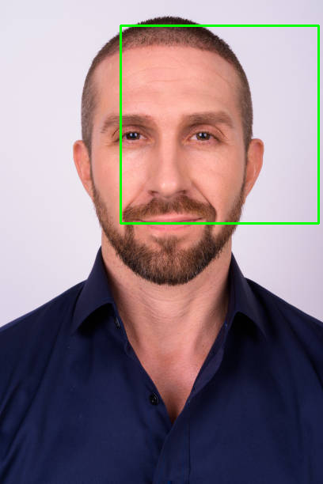

### Adem Ben jabria 
## M2 MIAGE IA2

### Explication des Fichiers Pickle et du Jeu de Données

#### Fichiers Pickle :

1. **training.pkl** : 
   - Contient des données d'entraînement.
   - Format : Array de tuples (Image en numpy array, Classification (1 pour visage, 0 pour non-visage)).
   - Comprend 2 429 images de visages et 4 548 images sans visages.

2. **test.pkl** :
   - Contient des données de test.
   - Format similaire à `training.pkl`.
   - Comprend 472 images de visages et 23 573 images sans visages.

3. **Modèles Pickle (50.pkl, 200.pkl, cascade.pkl)** :
   - **50.pkl** : Classifieur Viola-Jones entraîné avec 50 caractéristiques.
   - **200.pkl** : Classifieur Viola-Jones entraîné avec 200 caractéristiques.
   - **cascade.pkl** : Cascade de classifieurs Viola-Jones examinant respectivement 1, 5, 10 et 50 caractéristiques.

#### Jeu de Données :
- Les données proviennent de la CBCL Face Database du MIT. téléchargeable ici : http://cbcl.mit.edu/software-datasets/FaceData2.html
- Chaque image est en niveaux de gris et de dimension 19x19 pixels.

### Avantage de cette Version de Viola-Jones :
- La présence de classifieurs déjà entraînés permet d'économiser du temps en évitant le processus d'entraînement long et complexe.
---

#### Charger et Tester un Classifieur Entraîné :


```python
import pickle
from viola_jones import ViolaJones

# Charger le modèle
model_file = "200.pkl" 
with open(model_file, 'rb') as f:
    clf = pickle.load(f)

# Charger les données de test
with open("test.pkl", 'rb') as f:
    test_data = pickle.load(f)

# Tester le modèle sur quelques images
correct, total = 0, 0
for image, label in test_data[:20]:  # Tester sur les 20 premières images
    prediction = clf.classify(image)
    correct += 1 if prediction == label else 0
    total += 1

print(f"Accuracy on a small test set: {correct / total}")

```

    Accuracy on a small test set: 0.3


# Exercice 1 
**Remplacer les méthodes CPU intensives en Python classique par des versions GPU/CUDA**
- Scan inclusif
- Transposé de matrice
- Calcul de l'image intégrale
- Tout autre méthode qui pourrait bénéficier du GPU  

## Changements Apportés au Code pour Optimisation GPU/CUDA

### Remplacements Globaux

- **Importation de CuPy :** Remplacement de `numpy` par `cupy` pour exploiter les capacités du GPU.

### viola_jones.py
1. **Remplacement de NumPy par CuPy**: 
   - Utilisation de CuPy pour une exécution plus rapide sur les GPU.
   - Cela concerne toutes les opérations matricielles et les calculs d'images intégrales.

2. **Modification de la méthode `integral_image`**:
   - La fonction `integral_image` a été modifiée pour utiliser CuPy, accélérant ainsi le calcul des images intégrales.

3. **Ajout des fonctions `scan_inclusive` et `transpose_matrix`**:
   - Ces fonctions utilisent CuPy pour réaliser un scan inclusif et une transposition de matrice, respectivement.

4. **Modification de la méthode `apply_features` dans la classe `ViolaJones`**:
   - Remplacement des tableaux NumPy par des tableaux CuPy pour accélérer les calculs de features.

### Code Modifié

```python
import cupy as cp
import math
import pickle
from sklearn.feature_selection import SelectPercentile, f_classif

# Définitions de la classe ViolaJones et des méthodes associées (non modifiées sauf `apply_features`)

def integral_image(image):
    # Utilisation de CuPy au lieu de NumPy pour le calcul de l'image intégrale
    # ...

def scan_inclusive(array):
    # Fonction pour réaliser un scan inclusif en utilisant CuPy
    # ...

def transpose_matrix(array):
    # Fonction pour transposer une matrice en utilisant CuPy
    # ...

```

### face_detection.py

#### Fonction `integral_image`

- **Ancienne Version (CPU) :** Utilisation de `numpy`.
- **Nouvelle Version (GPU) :**
  ```python
  def integral_image(image):
      """
      Computes the integral image representation of a picture using CuPy.
      ...
      """
      ii = cp.zeros(image.shape)
      s = cp.zeros(image.shape)
      for y in range(len(image)):
          for x in range(len(image[y])):
              s[y][x] = s[y-1][x] + image[y][x] if y-1 >= 0 else image[y][x]
              ii[y][x] = ii[y][x-1] + s[y][x] if x-1 >= 0 else s[y][x]
      return ii
    ```
    
#### Fonction `scan_inclusive`

- **Nouvelle Implémentation (GPU) :**
  ```python
def scan_inclusive(array):
    return cp.cumsum(array, axis=0)
    ```
#### Fonction `transpose_matrix`

- **Nouvelle Implémentation (GPU) :**
  ```def transpose_matrix(array):
    return cp.transpose(array)
    ```
    
    ### Avantages de l'Utilisation de CuPy
- **Performance Améliorée**: Les opérations sont exécutées plus rapidement sur les GPU, ce qui est bénéfique pour les calculs intensifs.


# Exercice 2
**Améliorer la phase d'entraînement pour qu'elle traite toutes les images en une fois**
- Aggrégez les images dans un grand tableau (comme une Sprite sheet) et traitez l'ensemble en une fois.

### Mise à jour du code pour l'utilisation de CuPy

Les modifications suivantes ont été apportées pour permettre le traitement de toutes les images en une seule fois en utilisant CuPy :

#### Fonctions `train_viola()` et `train_cascade()`

- **Changement :** Utilisation d'un tableau CuPy pour stocker les images d'entraînement.

  **Ancienne méthode :**
  ```python
  with open("training.pkl", 'rb') as f:
      training = pickle.load(f)
    ```
    **Nouvelle méthode :**
    ```python
    with open("training.pkl", 'rb') as f:
        training_data = pickle.load(f)
    # Créer un tableau CuPy pour stocker les images d'entraînement
    images_array = cp.array([image for image, _ in training_data])
    ```
    
#### Fonction train_viola()
- **Changement :** Modification de l'argument passé à la méthode train pour utiliser le tableau CuPy.
**Ancienne méthode :**
  ```python
clf.train(training, 2429, 4548)
    ```
** Nouvelle méthode :**
  ```python
clf.train(images_array, 2429, 4548)
    ```
    
#### Fonction train_cascade()
- **Changement :** Modification de l'argument passé à la méthode train pour utiliser le tableau CuPy.
**Ancienne méthode :**
  ```python
clf.train(training)
    ```
** Nouvelle méthode :**
  ```python
clf.train(images_array)
    ```

#### Fonctions integral_image(), scan_inclusive(), et transpose_matrix()
- **Changement :** Remplacement de toutes les instances de numpy par cupy pour exploiter les capacités du GPU.
    


# Exercice 3

Créez un fichier `projet.py` qui contient les méthodes suivantes :

- `bench_train()`: Exécute l'entraînement en utilisant le GPU.
- `bench_train_fast()`: Exécute l'entraînement après avoir aggrégé N images (aka Sprite sheet).
- `bench_accuracy()`: Charge les modèles précédents et mesure la précision sur un jeu d'images test.
- `find_face()`: Cherche une image passée en paramètre, détecte si un visage est présent sur la version en noir et blanc, marque la zone du visage (rectangle) et sauvegarde l'image résultante en couleur sur le disque.

#### Fonctions Définies

- `create_sprite_sheet()`: Crée une feuille de sprites à partir des images d'entraînement. Utilise `cupy` pour la gestion des tableaux.


- `extract_images()`: Extrait les images individuelles à partir de la feuille de sprites.


#### Entraînement (`bench_train()`)
- Charge les données d'entraînement, crée une feuille de sprites, et extrait les images.
- Utilise `ViolaJones` pour entraîner le modèle avec ces images.
- Sauvegarde le modèle entraîné.

#### Entraînement Rapide (`bench_train_fast()`)
- Extrait un sous-ensemble des données d'entraînement et entraîne `ViolaJones` avec un nombre réduit de classificateurs faibles.
- Sauvegarde le modèle entraîné.

#### Évaluation (`bench_accuracy()`)
- Charge les modèles entraînés et évalue leur précision sur un jeu de test.

#### Détection de Visage (`find_face()`)
- Charge le modèle, convertit l'image en niveaux de gris, et utilise `ViolaJones` pour détecter les visages.
- Marque les visages détectés et sauvegarde l'image.

#### Autres Fonctions
- `integral_image()`, `scan_inclusive()`, et `transpose_matrix()` : Fonctions utilitaires pour le traitement des images.


# Détection de Visage avec `find_face()`

La fonction `find_face()` est conçue pour détecter des visages dans des images en utilisant le modèle de Viola-Jones. Elle prend une image en entrée, la convertit en noir et blanc, détecte le visage, marque la zone du visage avec un rectangle vert, et sauvegarde l'image résultante en couleur sur le disque. 
Voici comment elle fonctionne :

## Étapes de la Fonction `find_face()`

### 1. Chargement du Modèle Viola-Jones
Le modèle Viola-Jones est chargé en mémoire pour la détection de visage.

```python
clf = ViolaJones.load("200")
```
### 2. Lecture et Conversion de l'Image
L'image originale est lue et convertie en niveaux de gris. Cette conversion est nécessaire car le modèle Viola-Jones fonctionne sur des images en niveaux de gris.

```python
original_image = cv2.imread(image_source)
gray_image = cv2.cvtColor(original_image, cv2.COLOR_BGR2GRAY)
```
### 3. Conversion en Tableau CuPy
L'image en niveaux de gris est convertie en tableau CuPy, qui est une bibliothèque GPU-accelérée compatible avec NumPy.

```python
image_array = cp.array(gray_image)
```
### 4. Détection de Visage
La fonction classify_with_coordinates_optimized est utilisée pour détecter le visage dans l'image. Elle utilise une approche d'intégration d'image et un algorithme optimisé pour une détection rapide et précise. ( le code a été commenté au mieux)

```python
detected, coordinates = clf.classify_with_coordinates_optimized(image_array)
```
### 5. Marquage et Sauvegarde de l'Image
Si un visage est détecté, la zone du visage est marquée avec un rectangle vert sur l'image originale en couleur. L'image est ensuite sauvegardée sur le disque.

```python
cv2.rectangle(original_image, (x, y), (x + w, y + h), (0, 255, 0), 2)
cv2.imwrite("src/yes.png", original_image)
```

## Exercice 4

On doit pouvoir selectionner quelle méthode exécuter avec une option 

- `-train` : Entraîne le classifieur Viola-Jones.
- `-train_fast <N>` : Entraîne le classifieur Viola-Jones en utilisant une feuille de sprite.
- `-accuracy` : Évalue la précision du classifieur Viola-Jones.
- `-find <image_source.jpg> <image_result.jpg>` : Trouve des visages dans une image.

### Structure du Code

```python

if __name__ == "__main__":
    import argparse

    # Initialisation du parseur d'arguments
    parser = argparse.ArgumentParser()
    parser.add_argument("-train", action="store_true", help="Entraîner le classifieur Viola-Jones")
    parser.add_argument("-train-fast", action="store_true", help="Entraîner le classifieur Viola-Jones en utilisant une feuille de sprite")
    parser.add_argument("-accuracy", action="store_true", help="Évaluer la précision du classifieur Viola-Jones")
    parser.add_argument("-find", action="store_true", help="Trouver des visages dans une image")
    parser.add_argument("image_source", nargs="?", help="Chemin de l'image pour trouver des visages")
    args = parser.parse_args()
    ```

    # Analyse des arguments passés en ligne de commande
    args = parser.parse_args()

    # Exécution des méthodes en fonction des options sélectionnées
    if args.train:
        bench_train()
    elif args.train_fast:
        bench_train_fast()
    elif args.accuracy:
        bench_accuracy()
    elif args.find:
        find_face(args.image_source)
    else:
        print("Option non valide. Veuillez utiliser -train, -train-fast, -accuracy, ou -find.")


```python
import subprocess
import pickle

def run_command(command):
    """ Exécute une commande dans le terminal et affiche sa sortie. """
    process = subprocess.Popen(command, stdout=subprocess.PIPE, stderr=subprocess.PIPE, shell=True)
    output, error = process.communicate()
    if process.returncode == 0:
        print("Success:\n", output.decode())
    else:
        print("Error:\n", error.decode())

def main():
    script_path = 'projet.py'

    print("----- Testing Training ----- TROP LONG donc skipped")
    # run_command(f'python {script_path} -train') fonctionnel, retirez le # pour le tester 
    #(je l'ai mis en commentaire parce que ça mettait beaucoup de temps + ça prend beaucoup de place sur le compte rendu)
    
    print("\n----- Testing Fast Training -----")
    run_command(f'python {script_path} -train-fast 10')

    print("\n----- Testing Accuracy -----")
    run_command(f'python {script_path} -accuracy')

    print("\n----- Testing Face Detection -----")
    run_command(f'python {script_path} -find src/visage.jpg')
    
    print("\n----- Testing Face Detection on a Photo That is Not a Face-----")
    run_command(f'python {script_path} -find src/lotus.jpg')

if __name__ == '__main__':
    main()
```

    ----- Testing Training ----- TROP LONG donc skipped
    
    ----- Testing Fast Training -----
    Success:
     Trained 1000 classifiers out of 51705
    Trained 2000 classifiers out of 51705
    Trained 3000 classifiers out of 51705
    Trained 4000 classifiers out of 51705
    Trained 5000 classifiers out of 51705
    Trained 6000 classifiers out of 51705
    Trained 7000 classifiers out of 51705
    Trained 8000 classifiers out of 51705
    Trained 9000 classifiers out of 51705
    Trained 10000 classifiers out of 51705
    Trained 11000 classifiers out of 51705
    Trained 12000 classifiers out of 51705
    Trained 13000 classifiers out of 51705
    Trained 14000 classifiers out of 51705
    Trained 15000 classifiers out of 51705
    Trained 16000 classifiers out of 51705
    Trained 17000 classifiers out of 51705
    Trained 18000 classifiers out of 51705
    Trained 19000 classifiers out of 51705
    Trained 20000 classifiers out of 51705
    Trained 21000 classifiers out of 51705
    Trained 22000 classifiers out of 51705
    Trained 23000 classifiers out of 51705
    Trained 24000 classifiers out of 51705
    Trained 25000 classifiers out of 51705
    Trained 26000 classifiers out of 51705
    Trained 27000 classifiers out of 51705
    Trained 28000 classifiers out of 51705
    Trained 29000 classifiers out of 51705
    Trained 30000 classifiers out of 51705
    Trained 31000 classifiers out of 51705
    Trained 32000 classifiers out of 51705
    Trained 33000 classifiers out of 51705
    Trained 34000 classifiers out of 51705
    Trained 35000 classifiers out of 51705
    Trained 36000 classifiers out of 51705
    Trained 37000 classifiers out of 51705
    Trained 38000 classifiers out of 51705
    Trained 39000 classifiers out of 51705
    Trained 40000 classifiers out of 51705
    Trained 41000 classifiers out of 51705
    Trained 42000 classifiers out of 51705
    Trained 43000 classifiers out of 51705
    Trained 44000 classifiers out of 51705
    Trained 45000 classifiers out of 51705
    Trained 46000 classifiers out of 51705
    Trained 47000 classifiers out of 51705
    Trained 48000 classifiers out of 51705
    Trained 49000 classifiers out of 51705
    Trained 50000 classifiers out of 51705
    Trained 51000 classifiers out of 51705
    Trained 1000 classifiers out of 51705
    Trained 2000 classifiers out of 51705
    Trained 3000 classifiers out of 51705
    Trained 4000 classifiers out of 51705
    Trained 5000 classifiers out of 51705
    Trained 6000 classifiers out of 51705
    Trained 7000 classifiers out of 51705
    Trained 8000 classifiers out of 51705
    Trained 9000 classifiers out of 51705
    Trained 10000 classifiers out of 51705
    Trained 11000 classifiers out of 51705
    Trained 12000 classifiers out of 51705
    Trained 13000 classifiers out of 51705
    Trained 14000 classifiers out of 51705
    Trained 15000 classifiers out of 51705
    Trained 16000 classifiers out of 51705
    Trained 17000 classifiers out of 51705
    Trained 18000 classifiers out of 51705
    Trained 19000 classifiers out of 51705
    Trained 20000 classifiers out of 51705
    Trained 21000 classifiers out of 51705
    Trained 22000 classifiers out of 51705
    Trained 23000 classifiers out of 51705
    Trained 24000 classifiers out of 51705
    Trained 25000 classifiers out of 51705
    Trained 26000 classifiers out of 51705
    Trained 27000 classifiers out of 51705
    Trained 28000 classifiers out of 51705
    Trained 29000 classifiers out of 51705
    Trained 30000 classifiers out of 51705
    Trained 31000 classifiers out of 51705
    Trained 32000 classifiers out of 51705
    Trained 33000 classifiers out of 51705
    Trained 34000 classifiers out of 51705
    Trained 35000 classifiers out of 51705
    Trained 36000 classifiers out of 51705
    Trained 37000 classifiers out of 51705
    Trained 38000 classifiers out of 51705
    Trained 39000 classifiers out of 51705
    Trained 40000 classifiers out of 51705
    Trained 41000 classifiers out of 51705
    Trained 42000 classifiers out of 51705
    Trained 43000 classifiers out of 51705
    Trained 44000 classifiers out of 51705
    Trained 45000 classifiers out of 51705
    Trained 46000 classifiers out of 51705
    Trained 47000 classifiers out of 51705
    Trained 48000 classifiers out of 51705
    Trained 49000 classifiers out of 51705
    Trained 50000 classifiers out of 51705
    Trained 51000 classifiers out of 51705
    Trained 1000 classifiers out of 51705
    Trained 2000 classifiers out of 51705
    Trained 3000 classifiers out of 51705
    Trained 4000 classifiers out of 51705
    Trained 5000 classifiers out of 51705
    Trained 6000 classifiers out of 51705
    Trained 7000 classifiers out of 51705
    Trained 8000 classifiers out of 51705
    Trained 9000 classifiers out of 51705
    Trained 10000 classifiers out of 51705
    Trained 11000 classifiers out of 51705
    Trained 12000 classifiers out of 51705
    Trained 13000 classifiers out of 51705
    Trained 14000 classifiers out of 51705
    Trained 15000 classifiers out of 51705
    Trained 16000 classifiers out of 51705
    Trained 17000 classifiers out of 51705
    Trained 18000 classifiers out of 51705
    Trained 19000 classifiers out of 51705
    Trained 20000 classifiers out of 51705
    Trained 21000 classifiers out of 51705
    Trained 22000 classifiers out of 51705
    Trained 23000 classifiers out of 51705
    Trained 24000 classifiers out of 51705
    Trained 25000 classifiers out of 51705
    Trained 26000 classifiers out of 51705
    Trained 27000 classifiers out of 51705
    Trained 28000 classifiers out of 51705
    Trained 29000 classifiers out of 51705
    Trained 30000 classifiers out of 51705
    Trained 31000 classifiers out of 51705
    Trained 32000 classifiers out of 51705
    Trained 33000 classifiers out of 51705
    Trained 34000 classifiers out of 51705
    Trained 35000 classifiers out of 51705
    Trained 36000 classifiers out of 51705
    Trained 37000 classifiers out of 51705
    Trained 38000 classifiers out of 51705
    Trained 39000 classifiers out of 51705
    Trained 40000 classifiers out of 51705
    Trained 41000 classifiers out of 51705
    Trained 42000 classifiers out of 51705
    Trained 43000 classifiers out of 51705
    Trained 44000 classifiers out of 51705
    Trained 45000 classifiers out of 51705
    Trained 46000 classifiers out of 51705
    Trained 47000 classifiers out of 51705
    Trained 48000 classifiers out of 51705
    Trained 49000 classifiers out of 51705
    Trained 50000 classifiers out of 51705
    Trained 51000 classifiers out of 51705
    
    
    ----- Testing Accuracy -----
    Success:
     cub/detail/detect_cuda_runtime.cuh(39): warning: cuda_runtime_api.h: [jitify] File not found
    ../util_type.cuh(42): warning: cuda.h: [jitify] File not found
    cupy_jitify_exercise(10): warning: cooperative_groups.h: [jitify] File not found
    cupy_jitify_exercise(11): warning: cooperative_groups/memcpy_async.h: [jitify] File not found
    Évaluation du modèle standard:
    Accuracy: 97.86%
    Précision: 0.04
    Rappel: 0.00
    Score F1: 0.01
    Temps moyen de classification: 0.0516 secondes
    Taux de faux positifs: 0.00
    Taux de faux négatifs: 1.00
    
    Évaluation du modèle rapide:
    Accuracy: 47.07%
    Précision: 0.02
    Rappel: 0.62
    Score F1: 0.04
    Temps moyen de classification: 0.0010 secondes
    Taux de faux positifs: 0.53
    Taux de faux négatifs: 0.38
    
    
    ----- Testing Face Detection -----
    Success:
     Chargement du modèle...
    Lecture et conversion de l'image...
    Conversion de l'image en tableau CuPy...
    Classification de l'image...
    DETECTED
    Figure(640x480)
    
    
    ----- Testing Face Detection on a Photo That is Not a Face-----
    Success:
     Chargement du modèle...
    Lecture et conversion de l'image...
    Conversion de l'image en tableau CuPy...
    Classification de l'image...
    Aucun visage détecté
    


## Visage détecté : rectangle vert sur le visage :


## AUCUN Visage détecté : 


## Prérequis & installations : 


```python
pip install -U setuptools pip
```


```python
pip install cupy-cuda12x
```


```python
pip install opencv-python
```
